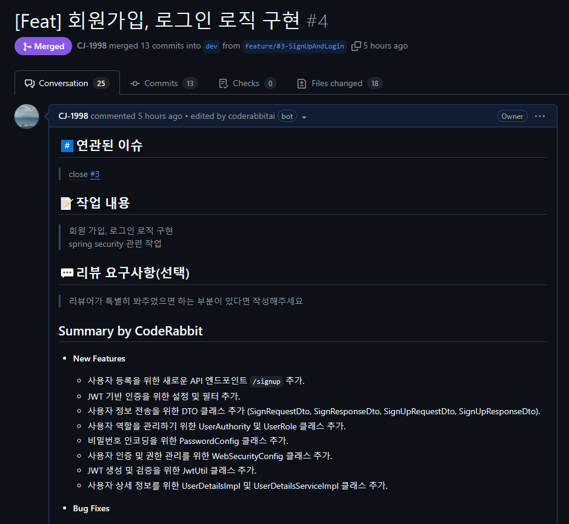
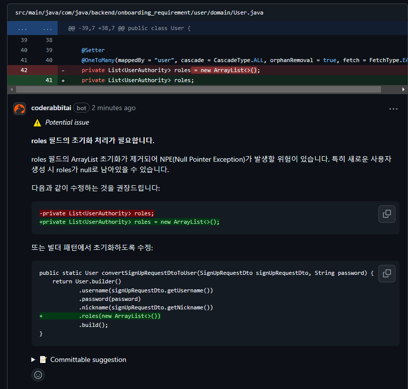

# Java Backend Onboarding Requirement

 

## Spring Security 기본 이해

### Filter란 무엇인가?
- Spring에서 `모든 호출은 DispatcherServlet을 통과`한다. 
- 그 이후에 각 요청을 담당하는 Controller로 분배된다. 
- 이 때 각 요청에 대해 `공통적으로 처리해야 할 필요가 있는 경우`가 있다. 
- 그래서 `DispatcherServlet 이전에 단계`가 필요한데 이것이 필터이다.

 

Client로부터 오는 `요청과 응답에 대해 최초, 최종 단계의 위치`다. 

따라서 요청과 응답의 정보 변경하거나 부가적인 기능을 추가할 수 있다. 

주로 `범용적으로 처리해야 하는 작업들에 활용`한다. 

예를 들어 로깅, 보안 처리, 인증 및 인가 처리 등을 할 수 있다. 

필터를 사용하면 이런 로직들을 `비즈니스 로직과 분리해 관리할 수 있다는 장점`이 있다. 

그리고 필터는 한 개만 존재하는 것이 아니라 `여러 개가 chain 형식으로 되어 있어서 처리`되고 있다. 

Spring Security도 `인증 및 인가를 처리하기 위해 Filter`를 사용한다. 

 

### Spring Security란? 
- Spring Security는 `프레임워크`다.
- Spring Security는 Spring 서버에 필요한 `인증 및 인가를 위해 많은 기능을 제공`한다. 
- 따라서 개발자가 인증 및 인가에 대한 코드를 직접 작성하지 않아도 된다. 
- 마치 Spring 프레임워크가 웹 서버 구현에 편의 제공하는 것과 같다. 
- Spring Security 프레임워크는 `인증 및 인가 구현에 편의 제공하는 것`이다.

 

Spring Security는 `필터를 사용해 인증, 인가 로직과 비즈니스 로직 분리`한다. 

Form Login으로 하면 UsernamePasswordAuthenticationFilter에서 처리한다. 

AuthenticationManager에서 `Authentication 객체 받아 인증을 시도`한다. 

인증 성공하면 `SecurityContextHolder에 Authentication 객체 설정`한다. 

Spring Security의 기본 로그인 설정은 세션 방식이다. 

 

## JWT 기본 이해

### JWT란 무엇인가요?
JWT는 Json Web Token의 약자다. 

JSON 포맷을 이용해 `사용자에 대한 속성 저장하는 Web Token이라는 의미`다. 

JWT는 누구나 평문으로 복호화 가능하다.

하지만 `Secret Key가 없으면 수정 불가능`하다. 

JWT는 Header, Payload, Signature로 구성되어 있다. 

 

**JWT 사용 흐름**
1. 클라이언트가 id, password를 서버로 보내 서버에서 로그인 성공함
2. 서버에서 사용자 정보를 secret key를 사용해 JWT로 암호화 함
3. 서버에서 쿠키의 value에 JWT를 담아 응답으로 보냄
4. 클라이언트 = 브라우저는 쿠키 저장소에 JWT 저장함
5. 클라이언트는 이후 요청 시 JWT를 같이 보냄
6. 서버에서 JWT를 받고 secret key를 사용해 JWT 위조 여부 검증
7. JWT 유효기간 지나지 않았는지 검증
8. 검증 성공하면 JWT에서 사용자 정보를 가져와 사용함

 

## Access / Refresh Token 발행과 검증에 관한 테스트 시나리오 작성

 

|테스트 번호|테스트 시나리오|입력 값|기대 결과|성공 여부|
|--|--|--|--|--|
|1|JwtUtil의 createAccessTocken 메서드를 사용해 token이 잘 생성되는지 확인|String username, List< String > roles|null이 아닌 String|O|
|2|JwtUtil의 createRefreshTocken 메서드를 사용해 token이 잘 생성되는지 확인|String username|null이 아닌 String|O|
|3|잘 생성된 Access Token을 JwtUtil의 validateToken 메서드를 사용해 token이 잘 검증되는지 확인|String accessToken|true|O|
|4|잘 생성된 Refresh Token을 JwtUtil의 validateToken 메서드를 사용해 token이 잘 검증되는지 확인|String refreshToken|true|O|
|5|잘 못 생성된 Access Token을 JwtUtil의 validateToken 메서드를 사용해 예외가 발생하는지 확인|String accessToken + "123"|SignatureException 발생|O|
|6|잘 못 생성된 Refresh Token을 JwtUtil의 validateToken 메서드를 사용해 예외가 발생하는지 확인|String refreshToken + "123"|SignatureException 발생|O|

 

## PR 및 AI 코드 리뷰 바탕으로 개선
### **PR 이미지**

 

 

### **AI 코드 리뷰 이미지**

 

 

## Swagger 주소
http://3.36.128.81:8080/swagger-ui/index.html#/

 

## EC2 배포 주소
http://3.36.128.81:8080/

 

- **회원 가입 API** : http://3.36.128.81:8080/signup
- **로그인 API** : http://3.36.128.81:8080/sign
